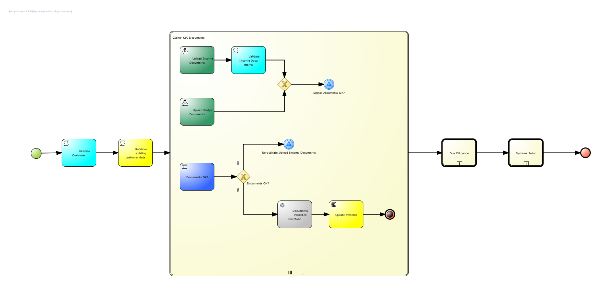

JBoss BPM Suite Know Your Customer Demo
==================================
This is a _Know Your Customer (KYC)_ process project. It is case-based, document driven, process based, in which the dynamic case-management concepts are implemented in an ad-hoc subprocess. The process demonstrates concepts like:
- AdHoc (sub) processes: dynamic processes in which order and relation of task execution is undefined and determined at runtime.
- AdHoc Completion Condition: ad-hoc processes are completed when the completion condition matches.
- Signaling: tasks can be dynamically activated at runtime using singals.
- Milestones: business rules define milestone criterias.
- Documents: documents are represented as `org.jbpm.document/.Document` process variables, which are marshalled and unmarshalled using the `DocumentMarshallingStrategy`. This allows for pluggability with an ECM for document management.


Furthermore, there are several tasks that can be activated to upload documents, as well as business-rule task to evaluate and validate the uploaded documents.

Finally, the process contains a number of reusable subprocesses that represent additional stages of the process. The current  reusable subprocess implementations are placeholder/dummy implementations.



There are two options available to you for using this demo; local and Docker.

Software
--------
The following software is required to run this demo:
- [JBoss EAP 7.0 installer](https://developers.redhat.com/download-manager/file/jboss-eap-7.0.0-installer.jar)
- [JBoss BPM Suite 6.4.0.GA deployable for EAP 7](https://developers.redhat.com/download-manager/content/origin/files/sha256/be/be13e233f70054ed071ebde7c8129d59431a5eb5cbf95eee046627592b679a1f/jboss-bpmsuite-6.4.0.GA-deployable-eap7.x.zip)
- Git client
- Maven 3.2+
- [7-Zip](http://www.7-zip.org/download.html) (Windows only): to overcome the Windows 260 character path length limit, we need 7-Zip to unzip the BPM Suite deployable.

Option 1 - Install on your machine
----------------------------------
1. [Download and unzip.](https://github.com/jbossdemocentral/bpms-kyc-demo/archive/master.zip)

2. Add products to installs directory. For example download and add BPMS installer jar into the installs directory.

3. Run 'init.sh' or 'init.bat' file. 'init.bat' must be run with Administrative privileges.

4. Start JBoss BPMS Server by running 'standalone.sh' or 'standalone.bat' in the <path-to-project>/target/jboss-eap-7.0/bin directory.

5. Login to [http://localhost:8080/business-central](http://localhost:8080/business-central)

    ```
     - login for admin and other roles (u:bpmsAdmin / p:bpmsuite1!)
    ```


Option 2 - Run in Docker
----------------------------------------------
The following steps can be used to configure and run the demo in a container

1. [Download and unzip.](https://github.com/jbossdemocentral/bpms-kyc-demo/archive/master.zip)

2. Add product installer to installs directory. For example download and add BPMS installer jar into the installs directory.

3. Run the 'init-docker.sh' or 'init-docker.ps1' file.

4. Start the container: `docker run -it -p 8080:8080 -p 9990:9990 jbossdemocentral/bpms-kyc-demo`

5. Login to http://&lt;DOCKER_HOST&gt;:8080/business-central

    ```
     - login for admin and other roles (u:bpmsAdmin / p:bpmsuite1!)
    ```

*Note*: Replace localhost with DOCKER_HOST when it appears in other locations within the documentation

Additional information can be found in the jbossdemocentral docker [developer repository](https://github.com/jbossdemocentral/docker-developer)

Starting a Know Your Customer process (just one scenario)
-----------------------------------------------
1. Build & deploy project.

2. Start process with following data in start form (either from JBoss BPM Suite dashboard or using external client
	 UI deployed at [http://localhost:8080/external-client-ui-form-1.0](http://localhost:8080/external-client-ui-form-1.0)):

  ```
  Name: [your-name]

  Surname: [your-surname]

  Email Adress: [any-email]

  Social Security Number (SSN): [any-number]
  ```

3. Login to [http://localhost:8080/business-central](http://localhost:8080/business-central)

  ```
  - login for admin role (u:bpmsAdmin / p:bpmsuite1!)
  ```

4. TODO: describe process execution.

5. Navigate to the "Tasks" tab -> "Task List" and click on it.

6. Expand the right-side pane window.   Click on the "Work" tab and click on "claim" to claim the task.

7. Upload a document in the provided UI. The UI asks for a passport, but in this demo we can provide any document.

8. TODO: First describe path in which the document gets rejected.

9. Check the logs and you will see that the .......

10. TODO: Describe how to complete the process.


Supporting Articles
-------------------
- TODO

Released versions
-----------------
See the tagged releases for the following versions of the product:

- v0.1 - JBoss BPM Suite 6.4.0.


[](https://youtu.be/dQw4w9WgXcQ)
